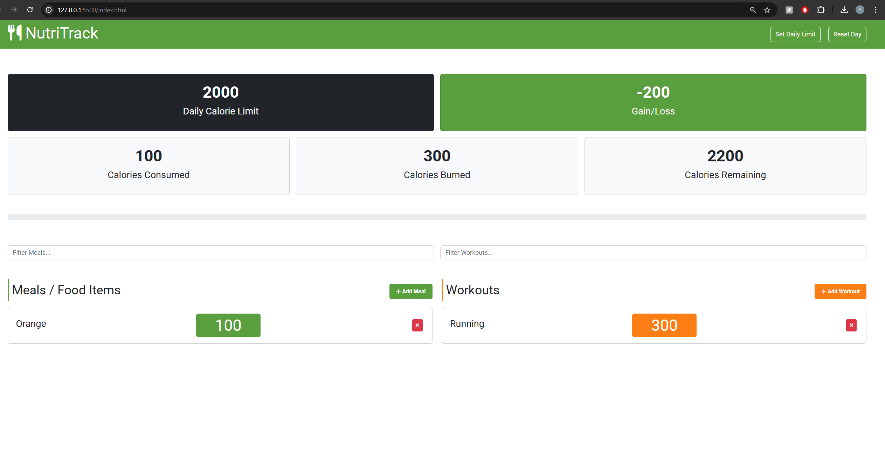

# NutriTrack

NutriTrack is a simple calorie counter app built with vanilla JavaScript. It helps you track your meals and workouts while calculating total calories consumed and burned.

---

## Features

- Track meals and workouts.
- Set daily calorie goals.
- Calculate calorie balance.
- Reset data for a fresh start.

---

## Screenshot

---

## Technologies

- HTML
- CSS
- JavaScript
- Bootstrap
---

## License

[MIT License](LICENSE)
****
